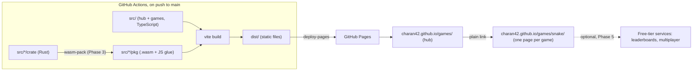

# Games: Architecture and Implementation Plan

> **Status:** Phase 1 built on branch `phase-1` (2026-09-27) · not deployed yet
> **Site:** `https://charan42.github.io/games/` (repo `Charan42/games`, GitHub Pages)
> **Next step:** answer [§12 Open questions](#12-open-questions), then start [Phase 1](#phase-1-foundation--first-game).

## 1. Goals

- Static site on GitHub Pages: no servers, no bills.
- A home page (the **hub**) with an overview of every game. Each game has its own URL (`/games/snake/`).
- Add games one at a time without touching the others.
- Any tech per game: TypeScript + Canvas now, WebAssembly (Rust, C/C++, engine exports) for heavier games later.
- **Mobile-first:** every game is designed for touch on a phone first, and also works with a keyboard and mouse. Games that need a keyboard or gamepad get their own "Keyboard & controller" section on the hub.

**Not in v1:** accounts, a backend, server rendering, monetization. Each one has an "add when" trigger in [§10](#10-idea-bank-making-it-bigger-for-free).

## 2. Core decision: every game is its own page

| URL | Source | What |
|---|---|---|
| `/games/` | `src/index.html` | Hub |
| `/games/snake/` | `src/snake/index.html` | TypeScript game |
| `/games/sand/` | `src/sand/index.html` | Rust → WASM game |

This is a multi-page app (MPA), not a single-page app (SPA). The hub is a page of links, and each game is a separate HTML document.

- **Real URLs on GitHub Pages.** Pages has no SPA fallback. A deep link into a React Router app returns 404 unless you use `#/hash` URLs or the `404.html` redirect hack. Here every game is a real file, so deep links, refresh and sharing all work.
- **Isolation for free.** Games hold a lot of global state: `requestAnimationFrame` loops, key listeners, WebGL and audio contexts, WASM memory. In an SPA, each game has to tear all of that down perfectly or it leaks into the next one. Leaving a page throws everything away.
- **Any tech per game.** Vanilla Canvas, Three.js, React, a Rust/WASM binary or a Godot export all work. The hub only links to them.
- **Each page loads only its own code.** A 5 MB WASM game never slows down the hub or a 30 KB puzzle.
- **Portable.** Any game can also be built on its own into a self-contained folder. You can zip it for itch.io or embed it in an `<iframe>` somewhere else.

The cost is a full page load between the hub and a game. Cross-document View Transitions (a few lines of CSS) smooth that over in Chromium and Safari.

## 3. Stack

| Concern | Choice | Why |
|---|---|---|
| Build + dev server | **Vite 8** in multi-page mode | Fast hot reload, TypeScript built in, per-page code splitting, handles `.wasm` files. Tested, see §4. |
| Language | **TypeScript**, `strict` | Vite removes the types; `tsc --noEmit` checks them. |
| Hub UI | **HTML + CSS + ~100 lines of TS** | A grid of links doesn't need a framework. Switch to Preact (~4 KB) only if the hub turns into an app. |
| Rendering | **Canvas 2D** for action games; **DOM + CSS** for grid, board, card and word games | Built into the browser. The DOM gives crisp text, accessibility and CSS animations for free. |
| Input | **Pointer Events** (touch, mouse and pen in one API) + keyboard; **Gamepad API** for controller games | Built into the browser. One code path covers touch and mouse. |
| React | **Allowed per game, never required** | Useful for UI-heavy games. Adds nothing to a canvas game loop. |
| Libraries, per game | PixiJS or Phaser (2D), Three.js (3D, WebGPU with WebGL2 fallback), Rapier (physics, WASM), ZzFX (~1 KB sound effects) | Only the game that imports a library downloads it. |
| WebAssembly | **Rust + wasm-pack** (`--target web`); Emscripten for C/C++; engine web exports | See §8. |
| Tests | **node:test** (built into Node, runs the TypeScript directly) for game logic; **one Playwright smoke test** across all pages, run on desktop and as an emulated phone | Logic tests since Phase 1, with no extra dependency. The smoke test starts in Phase 2. |
| Deploy | **GitHub Actions → Pages** (`upload-pages-artifact` + `deploy-pages`) | The official route. Free for public repos, no `gh-pages` branch. |
| Tooling | **npm** and **Node 22** (already installed), pinned in `.nvmrc` | Nothing extra to install. |

### Alternatives considered

| Option | Verdict |
|---|---|
| No build step (plain ES modules, deploy from branch) | Tempting, but TypeScript, npm packages and WASM glue code all need a bundler. Vite costs one config file. |
| Vite + React SPA + React Router | Needs hash URLs or a 404 hack on Pages. Games share one runtime, so leaks cross between games. Every game pays for React. |
| **Vite MPA, framework optional** | **Chosen:** real URLs, isolation, any tech per game. |
| Astro | Strong runner-up: static-first, typed content collections, easy tag pages, devlogs and OG images. It runs on Vite, so games would move over unchanged. Worth revisiting if the hub turns into a content site. |
| Next.js / SvelteKit static export | Server-first frameworks. Nothing here needs a server. |
| One engine (Phaser, Godot) for everything | An engine is a choice each game makes, not the site's architecture. |

## 4. Repo layout and build



```
games/                         repo root
├─ src/                        Vite root = site root
│  ├─ index.html               hub → /games/
│  ├─ hub.ts  hub.css
│  ├─ shared/                  no index.html, so not a page
│  │  ├─ types.ts              GameMeta (§5)
│  │  ├─ input.ts              swipe, tap, drag, keys, gamepad → game actions (§6)
│  │  ├─ bar.ts                top bar: ← All games · title · fullscreen · help
│  │  ├─ storage.ts            per-game localStorage keys (best score, settings)
│  │  ├─ canvas.ts             sizes a grid canvas to the screen
│  │  ├─ rng.ts                seeded random numbers (rule 7)
│  │  └─ base.css              mobile-first layout, gesture blocking, light/dark
│  ├─ _template/               starter game; built but unlisted (wip: true)
│  ├─ snake/                   one folder = one game → /games/snake/
│  │  └─ index.html  main.ts  meta.ts  logic.ts  logic.test.ts
│  └─ sand/                    a WASM game (Phase 3)
│     ├─ index.html  main.ts  meta.ts  thumb.webp
│     ├─ crate/                Rust source
│     └─ pkg/                  wasm-pack output: gitignored, built in CI
├─ public/                     copied as-is: icons, web app manifest, 404.html, engine exports
├─ Cargo.toml                  Rust workspace (Phase 3): members = ["src/*/crate"]
├─ vite.config.ts
├─ tsconfig.json
├─ package.json                "type": "module"
└─ .github/workflows/deploy.yml
```

The whole build config is below. Finding the pages takes two lines of Node, not a plugin:

```ts
// vite.config.ts
import { defineConfig } from 'vite'
import { existsSync, readdirSync } from 'node:fs'
import { resolve } from 'node:path'

const root = resolve(import.meta.dirname, 'src')
// every src/<dir>/index.html is a page; src/index.html is the hub
const pages = ['.', ...readdirSync(root)].filter(d => existsSync(resolve(root, d, 'index.html')))

export default defineConfig({
  root,
  base: './',       // relative URLs: the same build works under /games/, on a custom domain, or on itch.io
  appType: 'mpa',   // dev server 404s unknown paths like Pages does, instead of serving the hub
  publicDir: resolve(import.meta.dirname, 'public'),
  build: {
    outDir: resolve(import.meta.dirname, 'dist'),
    emptyOutDir: true,
    rolldownOptions: {
      input: Object.fromEntries(pages.map(d => [d === '.' ? 'hub' : d, resolve(root, d, 'index.html')])),
    },
  },
})
```

What the scratch build confirmed:

- `dist/index.html` loads `./assets/…` and `dist/snake/index.html` loads `../assets/…`, so relative paths work for nested pages.
- Each game gets its own named JS file (`snake-[hash].js`). Code in `shared/` goes into one shared file.
- A `.wasm` file loaded with `new URL('./pkg/x_bg.wasm', import.meta.url)` (the pattern wasm-bindgen generates) is hashed and copied to `dist/assets/`. No WASM plugin needed.
- The dev server serves `/snake/` but returns 404 for `/snake`. **Always link with a trailing slash.** Pages redirects `/snake` to `/snake/`, but the dev server doesn't.

## 5. The game contract

A game is a folder under `src/` that follows these rules:

1. **It has `index.html`:** a complete page. The build finds it automatically.
2. **It has `meta.ts`:** its hub card, written as `export default { … } satisfies GameMeta`. The file is pure data and imports only the type, so the hub never loads game code.
3. **It may have `thumb.webp`:** square, about 512×512, so it suits a two-column phone grid and portrait games alike. Without one, the hub shows a title card.
4. **It uses relative URLs only** (`./sprite.png`, `../`), so it works under any base path.
5. **It prefixes storage keys with its slug** through `shared/storage.ts` (`games:snake:best`; the slug comes from the URL). All games share one origin (see §11).
6. **It's touch-first.** With `input: 'touch'`, the game is fully playable by touch on a phone held upright (or sideways, if `landscape: true`), and keyboard and mouse trigger the same actions. With `input: 'controller'`, it needs a keyboard or gamepad and is listed in the hub's "Keyboard & controller" section. Every game pauses when the tab is hidden and honors `prefers-reduced-motion`. Details are in §6.
7. **Its logic is pure and seeded:** `step(state, input) → state`, kept separate from drawing, with a seeded random number generator instead of `Math.random()` for anything that affects play.

Rule 7 is the only planning-ahead in the contract. It costs no extra code, and unit tests, daily challenges, replays and multiplayer all depend on it. Adding it later means rewriting the game.

```ts
// src/shared/types.ts
export type Tag = 'arcade' | 'puzzle' | 'board' | 'word' | 'sim' | 'multiplayer'

export interface GameMeta {
  title: string
  blurb: string                   // one line on the card
  tags: Tag[]
  added: string                   // 'YYYY-MM-DD': sorts newest first, drives the "New" badge
  controls: string                // how to play, shown in the help dialog
  input: 'touch' | 'controller'   // 'controller' = needs a keyboard or gamepad; own hub section
  landscape?: boolean             // touch games are portrait unless this is set
  wip?: boolean                   // unlisted: built and reachable by URL, hidden from the hub in production
}
```

The hub picks up every game at build time with two globs, so there's no list to maintain:

```ts
const metas  = import.meta.glob<GameMeta>('./*/meta.ts', { eager: true, import: 'default' })
const thumbs = import.meta.glob<string>('./*/thumb.webp', { eager: true, import: 'default' })
```

**Adding a game:** run `cp -r src/_template src/<slug>`, then write the game. It deploys unlisted (`wip: true`), so you can send the URL to friends for testing. Remove `wip` to put it on the hub.

## 6. Mobile-first design

Every game is designed for a phone held upright first. Keyboard and mouse are extra ways to trigger the same actions. People open a casual games site from shared links, mostly on phones. It's also the cheaper direction: adding keys to a touch game is easy, but a keyboard game usually needs its controls and layout redesigned to work by touch.

Games that really need a keyboard or gamepad (platformers, twin-stick shooters, typing games) are the exception. They set `input: 'controller'` and get their own hub section.

**Controls by mechanic.** Touch input goes through Pointer Events and is turned into game actions. Keys map to the same actions.

| Mechanic | Touch design | On desktop |
|---|---|---|
| Swipe | Swipe direction steers or moves | Arrow keys or WASD |
| Tap | Tap to act, long-press for a second action | Click; right-click for the second action |
| Drag | The object follows the finger at an offset, so the finger never covers it | Mouse drag |
| Typing | An on-screen keyboard drawn in the page; the phone's own keyboard would cover half the screen | Physical keyboard |
| Joystick | Avoid in touch games. If one is unavoidable, use a stick that appears wherever the thumb lands | Keys or gamepad |

**Layout.**

- Design the playfield for a portrait phone. On desktop it's centered with space on either side.
- Use `100dvh` so the browser's collapsing toolbars don't crop the game, and `viewport-fit=cover` with `env(safe-area-inset-*)` to stay clear of notches and the home indicator.
- Put controls in the bottom third where thumbs reach, away from the screen edges. Safari's edge swipe for "back" can't be blocked.
- Make tap targets at least 44 px. On phones the game bar shrinks to icons.
- A game with `landscape: true` shows a "rotate your phone" hint when held upright. Locking the orientation only works in fullscreen on Android, so a hint is the approach that works everywhere.

**Keep the browser from taking over gestures** on the play area:

- `touch-action: none` prevents scrolling, pinch-zoom and double-tap zoom.
- `overscroll-behavior: none` prevents pull-to-refresh.
- `user-select: none` and `-webkit-touch-callout: none`, plus cancelling the `contextmenu` event, stop long-press from selecting text or opening menus.
- The hub itself stays zoomable: no `user-scalable=no` in the viewport tag.

**Feel and performance.**

- Game input reacts on `pointerdown`, when the finger touches, not when it lifts.
- Use vibration where supported (Android Chrome, not iOS Safari).
- Browsers block sound until the player interacts, so unlock audio on the first tap.
- Cap canvas resolution at 2× pixel density. 3× screens cost more than twice the pixels for little visible gain.
- Aim for 60 fps on a mid-range Android phone, and keep downloads small for mobile data.

**Full screen.** Android supports the Fullscreen API, but iPhone Safari doesn't support it for games. A web app manifest makes the site installable, and the installed app runs without browser UI on both. So the manifest ships in Phase 1, and offline caching waits for Phase 4.

**Keyboard & controller games.** They're playable with a keyboard, and with a gamepad where the game suits it. Keys and gamepad buttons map to the same actions. On a touch-only device, they open with a "Needs a keyboard or controller" message and a link back to the hub. The message goes away when a key is pressed or a gamepad connects, since phones and tablets can pair Bluetooth controllers.

**Testing on phones.**

- Check every new game on a real phone (see Local dev in §7).
- The Playwright smoke test runs twice: on desktop, and as an emulated phone with touch enabled that taps through the hub.
- Eruda, loaded when the URL has `?debug`, gives you a console on the phone. That's useful for iPhones, since Safari's debugger needs a Mac.

## 7. How the rest works

**Hub.** One `<a class="card" href="./snake/">` per game, newest first. Because the cards are real links, tap, long-press, middle-click and keyboard navigation all work without extra code. Each card shows a thumbnail, title, blurb and tags, plus a rotate icon for landscape games. `hub.ts` renders the cards; the page's own `<title>` and description are static HTML, which is all link previews need.

Touch games fill the main grid. Games with `input: 'controller'` go in a "Keyboard & controller" section below it: a native `<details>` element that starts collapsed on touch-only devices and open on desktop.

Later additions:

- Tag chips and search, kept in `?tag=` so filtered views can be shared. "Keyboard & controller" becomes one of the chips.
- A "Continue playing" row and your best score on each card
- A random-game button

Layout is phone first. A CSS grid with `repeat(auto-fill, minmax(150px, 1fr))` gives two columns on most phones and more on wider screens. Light/dark follows `prefers-color-scheme`, and thumbnails are lazy-loaded with fixed dimensions so the page doesn't jump.

**Game bar.** `shared/bar.ts` is about 40 lines, with no framework. It has three controls:

- ← All games (`href="../"`)
- Fullscreen (Fullscreen API). Hidden where unsupported, such as iPhone Safari, and inside the installed app.
- Help (a native `<dialog>` showing `meta.controls`). Opening it pauses the game.

It also shows the game title. On phones it shrinks to icons. Two more features come when something needs them: a mute button with the first game that has sound, and recording "last played" with the hub's "Continue playing" row in Phase 2.

**Shared code.** Code starts inside its game and moves to `shared/` once a second game needs it. Snake and the template already share input, canvas sizing, the seeded random number generator and storage. Input handles swipes and keys so far; tap, drag and gamepad get added when a game needs them. Next in line: a fixed-timestep game loop when a second real-time game arrives, then audio unlock and mute.

**Deploy.** Set repo Settings → Pages → Source to **GitHub Actions**. On each push to `main`, the workflow runs these steps:

1. Check out the repo.
2. Set up Node from `.nvmrc`, with the npm cache.
3. Run `npm ci`.
4. Run `npm run build` (`tsc --noEmit && vite build`).
5. Upload `dist/` with `upload-pages-artifact`.
6. Publish with `deploy-pages`.

Jekyll doesn't run on Actions deploys, so the `_template/` folder is served normally and no `.nojekyll` file is needed. `public/404.html` handles unknown paths.

**Local dev.**

- `npm run dev` serves the hub at `localhost:5173/` and games at `/snake/`.
- `npm run build && npm run preview` checks the production build.
- `npm run dev -- --host` lets you test on a phone over your LAN. Service workers and Web Share need HTTPS away from localhost, so test those on the deployed site.

## 8. WebAssembly strategy

**WASM pays off for** CPU-heavy work: physics, simulations (falling sand, cellular automata), pathfinding, game-tree search (chess AI) and procedural generation. It also gives steady frame times, because there are no garbage-collection pauses, and it lets you reuse existing Rust or C/C++ code and engines.

**WASM doesn't help** with typical 2D game logic. Modern JS engines are fast, and drawing goes through the same Canvas/WebGL/WebGPU APIs either way, because WASM reaches them through JS glue code. Games limited by the GPU need WebGL2 or WebGPU, not WASM. And WASM engines are multi-MB downloads, where a TS game is tens of KB.

**Rule: write the game in TypeScript first. Move the slow loop to WASM once profiling shows it's the bottleneck.**

| Tier | What | Toolchain | Example |
|---|---|---|---|
| 0 | Plain TypeScript | None | Snake, 2048, Minesweeper |
| 1 | Use a WASM library from npm | None beyond `npm i` | Physics puzzle on Rapier; chess against Stockfish |
| 2 | Rust core for the slow loop; TS keeps rendering, input and UI | Rust + wasm-pack | Falling sand: Rust updates a pixel buffer in WASM memory, TS draws it with `putImageData` or a WebGL texture |
| 3 | Whole game in an engine compiled to WASM; the page just hosts a `<canvas>` | macroquad or Bevy (Rust), raylib + Emscripten (C), Godot | A 3D game; a large 2D game |

**Tier 2 setup (Phase 3).**

- Build each crate with `wasm-pack build --target web --out-dir ../pkg`. When the old `rustwasm` GitHub org shut down in 2025, wasm-pack moved to the `wasm-bindgen` org, and it still gets releases (v0.15.0, May 2026). It generates `.d.ts` files, so TypeScript type-checks every call into Rust.
- `--target web` output needs no Vite plugin (confirmed in §4).
- Use one Cargo workspace at the repo root (`members = ["src/*/crate"]`). That gives one `target/` folder, one `Cargo.lock` and a shared build cache.
- Keep binaries small with `[profile.release] opt-level = "z"` and `lto = true`, plus the `wasm-opt` pass that wasm-pack runs.
- CI builds `pkg/`, with the Rust toolchain and the `wasm32-unknown-unknown` target cached. Locally you only need Rust when working on a WASM game. It isn't installed on this machine yet.

**Tier 3 notes.**

- macroquad is tiny and simple, good for 2D. Bevy is a full engine, but it's a multi-MB download and needs a loading screen.
- Engines are heaviest on phones: multi-MB downloads over mobile data and tighter memory limits, especially on iOS. Test on a real phone before committing to one. Big engine games often suit the keyboard & controller section better.
- Vite doesn't process engine exports (Godot, Unity, Emscripten). Put the export in `public/<slug>/`, and keep `meta.ts` and `thumb.webp` in `src/<slug>/` for the hub card.
- Godot: use the single-threaded web export (4.3+) with GDScript, and check whether C# can target the web yet.
- Unity: set compression to Disabled or turn on Decompression Fallback. Pages can't send the `Content-Encoding` header that pre-compressed `.br`/`.gz` files need.
- Don't commit large binaries, because every re-export stays in git history forever. Attach them to a GitHub Release and have the deploy workflow download them into `dist/`. Pages then serves them like any other file.

**GitHub Pages and WASM.**

- ✅ Pages serves `.wasm` files as `application/wasm`, so `WebAssembly.instantiateStreaming` (compiling while downloading) works.
- ❌ You can't set response headers, so there's no COOP/COEP. That means no `SharedArrayBuffer` and **no WASM threads**. Build single-threaded by default. If a game really needs threads, you have two options:
  - `coi-serviceworker`, a service worker that adds the headers. It costs one page reload on the first visit.
  - Host that game on Cloudflare (set headers with a `_headers` file) or itch.io (it has a SharedArrayBuffer setting).
- If you add a Content-Security-Policy `<meta>` tag, WASM needs `'wasm-unsafe-eval'` in `script-src`.
- Graphics: WebGL2 works everywhere. WebGPU is available in Chromium and Safari 26, and Firefox is rolling it out platform by platform. Use it through Three.js, Babylon.js or Bevy with a WebGL2 fallback rather than directly.

## 9. Implementation plan

Every phase ends with the site deployed and working.

### Phase 0: decisions

- [ ] Answer §12.
- [ ] Set repo Settings → Pages → Source to GitHub Actions.
- [ ] Choose a license, for example MIT for code. Record each game's asset licenses in its folder.

### Phase 1: foundation + first game

Built on branch `phase-1`. Tested in headless Chrome as an emulated phone and on desktop:

- Touch swipes and keyboard control work.
- Pausing, game over and restart work.
- The page doesn't scroll during play.
- Chrome reports the site as installable.

Still to do: enable Pages, merge to `main`, and play it on a real phone.

- [x] `package.json` (`"type": "module"`; scripts `dev`, `build`, `preview`, `test`), `tsconfig.json` (strict), `.nvmrc`, `.gitignore`, `vite.config.ts`.
- [x] `shared/types.ts`, `shared/bar.ts`, and `shared/base.css` with the mobile-first basics from §6: `dvh` layout, safe areas, gesture blocking.
- [x] Hub: `index.html` + `hub.ts` card grid, laid out for phones first.
- [x] Web app manifest + icons, so the site can be installed and played without browser UI.
- [x] Game #1, **Snake**: Canvas 2D, swipe to steer, arrow keys too, best score. It's small, but it exercises the game loop, touch and keyboard input, storage and resizing. Its logic has `node:test` tests.
- [x] `src/_template/`: a minimal working touch game that follows §5 and §6.
- [x] `public/404.html`, favicon, `deploy.yml`.
- **Done when:**
  - `charan42.github.io/games/` lists Snake, and the hub looks right on a phone.
  - On a real phone held upright, `/games/snake/` plays by touch without the page scrolling, zooming or refreshing mid-game.
  - It also plays with arrow keys on desktop.
  - Refreshing the game's URL loads the game again, and ← returns to the hub.
  - Adding the site to the home screen opens it without browser UI.

### Phase 2: grow the catalog

- [ ] 3–5 touch games from the backlog below, mixing Canvas and DOM games, plus one keyboard & controller game (the platformer) so that hub section has something in it.
- [ ] Move `input.ts` into `shared/` when the second game needs it, then other helpers as they get reused.
- [ ] Hub: "Keyboard & controller" section, tag filter, search, "Continue playing", best scores, "New" badge.
- [ ] Tests: a `node:test` file for each game's logic (as Snake has), plus one Playwright test that opens the hub and every page, on desktop and as an emulated phone, and fails on console errors. Both run in CI before deploy.
- [ ] Eruda on `?debug` for debugging on phones.
- [ ] Accessibility pass: keyboard navigation, visible focus, reduced motion, 44 px tap targets.
- **Done when:**
  - Adding a game means copying the template, writing the code and pushing.
  - A broken game fails CI instead of reaching the live site.
  - Every touch game has passed a check on a real phone.

### Phase 3: WebAssembly

- [ ] Tier 1: a physics puzzle on `@dimforge/rapier2d-compat`. This proves WASM works on Pages without any toolchain.
- [ ] Tier 2:
  - Install `rustup`, the `wasm32-unknown-unknown` target and wasm-pack.
  - Set up the root Cargo workspace and build the first Rust game (falling sand).
  - Make CI build `pkg/` before `vite build`.
  - Add a loading indicator.
- [ ] Learning exercise: port Connect Four's AI from TS to Rust and measure the difference.
- [ ] Tier 3, when a game calls for it.
- **Done when:** a Rust game builds from source in CI and plays on Pages.

### Phase 4: reach (all free)

- [ ] Offline play via vite-plugin-pwa (the manifest already shipped in Phase 1):
  - Precache only the hub, and cache each game the first time it's played.
  - Pages only lets browsers cache files for 10 minutes, so this also makes repeat visits load instantly.
- [ ] A small Vite plugin that adds each game's `<title>`, description and Open Graph image from `meta.ts`, plus a `sitemap.xml`.
- [ ] Cross-document view transitions (CSS only).
- [ ] Daily challenge + share button (Web Share API with a clipboard fallback; Wordle-style emoji result).
- [ ] Cookie-less analytics (Cloudflare Web Analytics or GoatCounter) to see which games get played.
- [ ] Optional: custom domain; standalone builds for itch.io.

### Phase 5: online (only if wanted)

Leaderboards, multiplayer and comments are covered in §10. Each uses a free-tier service rather than a server of our own.

### Starter game backlog

| Game | Input | Tech | What it proves |
|---|---|---|---|
| Snake | Touch: swipe | Canvas 2D | Game loop, input, storage, the deploy pipeline |
| 2048 | Touch: swipe | DOM + CSS transitions | Pure-logic tests |
| Minesweeper | Touch: tap, long-press to flag | DOM | Seeded boards, flood fill, a first tap that's always safe |
| Breakout | Touch: drag | Canvas 2D | Collisions, offset drag |
| Falling blocks | Touch: swipe, tap to rotate | Canvas 2D | Rotation, timing, difficulty curve |
| Daily word game | Touch: on-screen keyboard | DOM | Date-seeded daily puzzle, sharing results |
| Connect Four vs AI | Touch: tap a column | DOM + TS minimax | Game AI; later a TS-vs-WASM benchmark |
| Physics puzzle | Touch: drag | Rapier (WASM from npm) | Tier 1 |
| Falling sand | Touch: drag to paint | Rust → WASM + Canvas | Tier 2 |
| Chess vs Stockfish | Touch: tap a piece, then a square | Stockfish WASM in a Web Worker | Workers + a WASM engine |
| 3D runner | Touch: swipe between lanes | Three.js, WebGPU renderer | 3D with a WebGL2 fallback |
| Online Connect Four | Touch: tap a column | Trystero (WebRTC) | Multiplayer with no server |
| Platformer | Controller: keys or gamepad | Canvas 2D or Phaser | The keyboard & controller section, Gamepad API |
| Twin-stick arena shooter | Controller: gamepad sticks, or keys + mouse | Rust → WASM (Tier 2 or 3) | Many entities on screen, analog input |

Give clones generic names: Tetris, Wordle, Pac-Man and Flappy Bird are trademarks.

## 10. Idea bank: making it bigger (for free)

Nothing here gets built until its trigger happens.

**Reach and polish, no backend**

| Idea | How (free) | Add when |
|---|---|---|
| Nicer URL, own origin | Custom domain on Pages (free HTTPS), or a free `*.js.org` / `*.is-a.dev` subdomain | You want to share it widely, or need origin isolation (§11) |
| Offline play | Service worker via vite-plugin-pwa | Phase 4 |
| Social previews | OG image + tags per game | You start sharing links |
| Daily challenges | Date-seeded random numbers, so everyone gets the same puzzle; streaks in localStorage | You have a puzzle game |
| Challenge-a-friend links | Put the seed, score and recorded inputs (compressed with `CompressionStream`) in the URL hash. Your friend plays the same run against your ghost | Games follow contract rule 7 |
| Achievements and stats | localStorage, plus save-file export and import | 5+ games |
| Embeds | `?embed` hides the bar so other sites can put a game in an iframe | Someone asks |
| Cross-posting | Build one game on its own, zip it, upload to itch.io, Newgrounds or Game Jolt | A game is polished |
| Support links | GitHub Sponsors, Ko-fi | Anytime. For ads or sales, host elsewhere: Pages' terms rule out mainly commercial sites |

**Community, with GitHub as the backend**

| Idea | How (free) | Add when |
|---|---|---|
| Comments per game | Giscus (GitHub Discussions) | You want feedback |
| Bug reports and requests | Issue templates, Discussions | Early |
| Games from other people | Pull requests that follow the game contract, checked by CI | Someone offers, but read the same-origin warning in §11 first |
| Game jams | A Discussions category + a `jam` tag | You have an audience |

**Online, on free tiers**

| Idea | How (free) | Add when |
|---|---|---|
| Global leaderboards | Cloudflare Worker + D1 (the Worker checks and rate-limits scores), or Supabase/Firebase with security rules | Players want to compare scores |
| Peer-to-peer multiplayer | WebRTC via Trystero (it finds other players through public relays, so no server) or PeerJS | A turn-based game exists |
| Phone-as-controller party games | A big screen shows the game and a QR code; phones join over WebRTC (Trystero) and become the controllers, AirConsole-style, with no server | You have a multiplayer game |
| Real-time rooms | Cloudflare Durable Objects (available on the free plan) + WebSockets | Peer-to-peer isn't reliable enough |
| Sign-in / cloud saves | Supabase Auth or Firebase Auth with GitHub login | Leaderboards need identity |

Pick one vendor to keep the number of accounts down. Cloudflare covers overflow hosting, leaderboards and real-time rooms. Some caveats:

- Scores sent from the browser can be faked. Keep leaderboards casual, or re-run the submitted inputs on the server, which rule 7 makes possible.
- Only ship public/anon keys, and enforce everything in security rules or the Worker.
- Supabase pauses free projects after a week without activity.
- Some players behind strict NATs can't connect peer-to-peer without a TURN relay.

**Tech showcases**

| Idea | How (free) |
|---|---|
| AI opponents | Minimax or Monte Carlo tree search in TS, then ported to WASM. Stockfish is GPL-3.0, so keep it in its own folder with its license and run it as a separate Web Worker |
| In-browser ML | ONNX Runtime Web or transformers.js on WebGPU for trained opponents. WebLLM for an AI-narrated text adventure: the model downloads from Hugging Face, not your Pages quota (GB-sized, desktop only) |
| Homebrew arcade | EmulatorJS (emulator cores compiled to WASM) or js-dos. **Only homebrew or freeware ROMs you have the rights to** |
| WebGPU demos | Three.js WebGPURenderer, Bevy |

**Operations**

| Idea | How (free) | Add when |
|---|---|---|
| Error tracking | Sentry free tier | Players report bugs you can't reproduce |
| PR preview URLs | Also deploy to Cloudflare, which gives each branch a URL (Pages doesn't) | You start working in pull requests |
| Performance budgets | Lighthouse CI or a bundle-size check | The hub gets slower |
| Dependency updates | Dependabot security updates (a repo setting) | Now; it's free |

## 11. Hosting cheat sheet and limits

| Host | Static bandwidth | Custom headers (COOP/COEP) | Preview deploys | Worth knowing | Role |
|---|---|---|---|---|---|
| GitHub Pages | 100 GB/month (soft limit) | ❌ | ❌ | 1 GB max site size; 10-minute deploy timeout; public repo on the free plan; not for commercial sites | **Primary host** |
| Cloudflare Workers static assets (or Pages) | Unlimited, free | ✅ `_headers` file | ✅ | 20,000 files per deploy, 25 MiB per file | Overflow, threaded-WASM games, previews |
| itch.io | Free | ✅ SharedArrayBuffer setting | — | One upload per game | Distribution + community |
| Netlify / Vercel (Hobby) | Metered free tiers | ✅ | ✅ | Vercel Hobby is non-commercial only | Not needed |

**Budget math.** 100 GB/month is about 200,000 plays of a 0.5 MB TypeScript game, or 10,000 plays of a 10 MB WASM game, before browser caching. If something takes off, point the same `dist/` at Cloudflare. The site is plain static files, so switching hosts only changes the deploy step, not the code.

**Guardrails.**

- Keep `dist/` well under 1 GB: a few MB per TS game, and a loading screen for anything over ~5 MB.
- Large binaries (engine exports, audio packs) go in GitHub Releases pulled in by CI, not in git history.
- **One origin for everything.** Every Pages project site under `charan42.github.io` shares one origin, including this one and any other repo you publish. So they all share localStorage and IndexedDB. That means:
  - Prefix storage keys with the game's slug (rule 5), and never store secrets there.
  - Don't run untrusted game code from other people on this origin. Put it in a sandboxed `<iframe>` or on a different origin.
  - A custom domain gives the site an origin of its own.

## 12. Open questions

Defaults are in parentheses. Phase 1 was built with the defaults.

1. **URL:** keep `charan42.github.io/games/`, or use a custom domain or free subdomain? (Keep it. The relative-path build works either way; this only affects absolute URLs in OG tags and the sitemap, in Phase 4.)
2. **Games:** Snake first, then which? (The backlog order.)
3. **React:** allow React/Preact in DOM-heavy games, or keep everything vanilla? (Allowed, not required.)
4. **Controller games on phones:** show them in a collapsed section, or hide them entirely on touch-only devices? (Collapsed section. Phones can pair Bluetooth controllers, and hidden games are easy to miss.)
5. **Orientation:** portrait by default for touch games, with `landscape: true` as the exception? (Yes.)
6. **Rust:** OK to install the Rust toolchain in Phase 3? (Yes. It's only needed for WASM games.)

## 13. Deliberately skipped

- **Linter/formatter:** add Biome when a second contributor arrives. Until then, strict `tsc` is the check.
- **Router or state library:** the site has no client-side routing.
- **Monorepo/workspaces:** keep one `package.json` until a game needs its own toolchain.
- **Our own backend:** only when no free-tier service can do the job.

## References

- [GitHub Pages limits](https://docs.github.com/en/pages/getting-started-with-github-pages/github-pages-limits)
- [Vite: multi-page apps](https://vite.dev/guide/build#multi-page-app)
- [Cloudflare static asset limits (2025-09 changelog)](https://developers.cloudflare.com/changelog/2025-09-02-increased-static-asset-limits/) · [Workers pricing](https://developers.cloudflare.com/workers/platform/pricing/)
- [Sunsetting the rustwasm GitHub org](https://blog.rust-lang.org/inside-rust/2025/07/21/sunsetting-the-rustwasm-github-org) · [wasm-pack](https://github.com/wasm-bindgen/wasm-pack)
- [coi-serviceworker](https://github.com/gzuidhof/coi-serviceworker)
